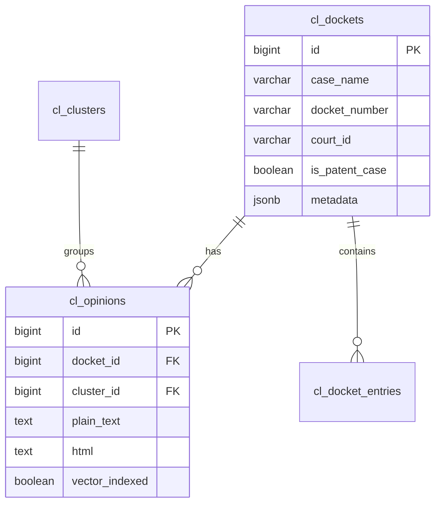

# CourtListener Integration Documentation

## Overview

The CourtListener integration provides automated retrieval and processing of federal court opinions and dockets, seamlessly integrating with the Aletheia RAG (Retrieval-Augmented Generation) system through PostgreSQL and Haystack/Elasticsearch.

## Current Implementation Status

### ✅ Implemented Features
- **API Authentication**: Secure token-based authentication with CourtListener API
- **Court Data Retrieval**: Bulk download of dockets and opinions from federal courts
- **Rate Limiting**: Compliant with API limits (4,500 requests/hour)
- **PostgreSQL Storage**: Complete schema for storing court data
- **Haystack Integration**: Direct ingestion pipeline from PostgreSQL to Elasticsearch
- **Data Transformation**: Automatic conversion from JSON to structured database records

### 📊 Data Pipeline Architecture


## Database Schema

### PostgreSQL Tables

```sql
court_data schema
├── cl_dockets          # Main case information
├── cl_opinions         # Opinion documents with full text
├── cl_clusters         # Opinion clusters (groups related opinions)
├── cl_docket_entries   # Individual docket entries
└── unified_court_data  # Combined view of all court data sources
```

### Key Relationships



## Supported Courts

| Court ID | Court Name | Status |
|----------|------------|--------|
| ded | District of Delaware | ✅ Active |
| txed | Eastern District of Texas | ✅ Active |
| cand | Northern District of California | ✅ Active |
| cafc | Court of Appeals for the Federal Circuit | ✅ Active |
| cacd | Central District of California | ✅ Active |
| nysd | Southern District of New York | ✅ Active |

## Quick Start Guide

### 1. Prerequisites
- CourtListener API key (stored in `.env` as `COURTLISTENER_API_TOKEN`)
- PostgreSQL database with `court_data` schema
- Haystack service running on port 8000

### 2. Initial Setup

```bash
# Initialize database schema
psql -U $DB_USER -d $DB_NAME -f court-processor/scripts/init_courtlistener_schema.sql

# Verify API connectivity
python court-processor/courtlistener_integration/verify_api.py
```

### 3. Download Court Data

```bash
# Download recent opinions (last 30 days)
python court-processor/courtlistener_integration/bulk_download.py \
    --court txed \
    --days 30 \
    --output-dir /data/courtlistener
```

### 4. Load to PostgreSQL

```bash
# Import downloaded JSON files
python court-processor/courtlistener_integration/load_to_postgres.py \
    --input-dir /data/courtlistener/txed
```

### 5. Ingest to Haystack

```bash
# Send to Haystack for RAG indexing
python court-processor/courtlistener_integration/ingest_to_haystack.py \
    --limit 100  # Start with small batch
```

## Data Flow Details

### 1. CourtListener API → JSON Files
- Retrieves dockets and opinions separately
- Saves as timestamped JSON files
- Handles pagination automatically
- Implements exponential backoff for rate limits

### 2. JSON Files → PostgreSQL
- Parses JSON structure
- Extracts key fields (case name, docket number, opinion text)
- Detects patent cases automatically
- Maintains relationships between dockets and opinions

### 3. PostgreSQL → Haystack
- Queries unindexed opinions with text content
- Formats documents with comprehensive metadata
- Sends to Haystack `/ingest` endpoint
- Updates `vector_indexed` flag after successful ingestion

## Current Limitations

1. **Missing Cluster Data**: Opinion clustering information not fully available
2. **Partial Text Coverage**: Only ~0.5% of opinions have full text
3. **No Real-time Updates**: Requires manual execution (scheduling not implemented)
4. **Limited Search Fields**: Some metadata fields not yet indexed

## Future Recommendations

### Short Term (1-2 weeks)
1. **Implement Scheduled Updates**: Add cron job or n8n workflow for daily updates
2. **Add Missing Endpoints**: Implement batch_hierarchy endpoint in Haystack service
3. **Enhance Error Handling**: Better recovery from partial failures

### Medium Term (1-2 months)
1. **Real-time Webhooks**: Subscribe to CourtListener webhooks for instant updates
2. **Full Text Retrieval**: Implement PDF download and OCR for opinions without text
3. **Advanced Search**: Add judge-based, date-range, and citation search

### Long Term (3-6 months)
1. **Multi-jurisdiction Support**: Extend to state courts and international sources
2. **Citation Network Analysis**: Build citation graphs for related case discovery
3. **AI-Enhanced Summaries**: Generate case summaries using LLMs

## Troubleshooting

### Common Issues

**Problem**: "Connection refused" when ingesting to Haystack
```bash
# Solution: Use Docker service name
python ingest_to_haystack.py --haystack-url http://haystack-judicial:8000
```

**Problem**: Rate limit errors from CourtListener
```bash
# Solution: Reduce concurrent requests
python bulk_download.py --max-concurrent 2
```

**Problem**: PostgreSQL schema errors
```sql
-- Solution: Drop and recreate schema
DROP SCHEMA IF EXISTS court_data CASCADE;
CREATE SCHEMA court_data;
```

## API Usage Examples

### Verify Courts
```python
from courtlistener_integration.verify_api import verify_courts

courts = ['ded', 'txed', 'cand']
for court_id in courts:
    if verify_court(court_id):
        print(f"✅ {court_id} is valid")
```

### Search Opinions in Haystack
```bash
curl -X POST http://localhost:8000/search \
  -H "Content-Type: application/json" \
  -d '{
    "query": "patent infringement Delaware",
    "top_k": 10,
    "use_hybrid": true,
    "filters": {"metadata.court": "ded"}
  }'
```

## Metrics and Monitoring

### Current Data Statistics (as of last run)
- **Total Dockets**: 408 (Texas Eastern District, 30 days)
- **Total Opinions**: 3,420
- **Opinions with Text**: 20 (~0.5%)
- **Successfully Indexed**: 10 (test batch)

### Performance Benchmarks
- **API Download**: ~100 dockets/minute (with rate limiting)
- **PostgreSQL Import**: ~1,000 records/second
- **Haystack Ingestion**: ~50 documents/second

## Integration with n8n Workflows

The CourtListener data can be accessed through n8n workflows using:
1. **PostgreSQL Node**: Direct database queries
2. **Haystack Node**: Search operations via custom node
3. **Webhook Triggers**: Automated processing pipelines

Example workflow available at: `workflow_json/courtlistener_to_rag.json`