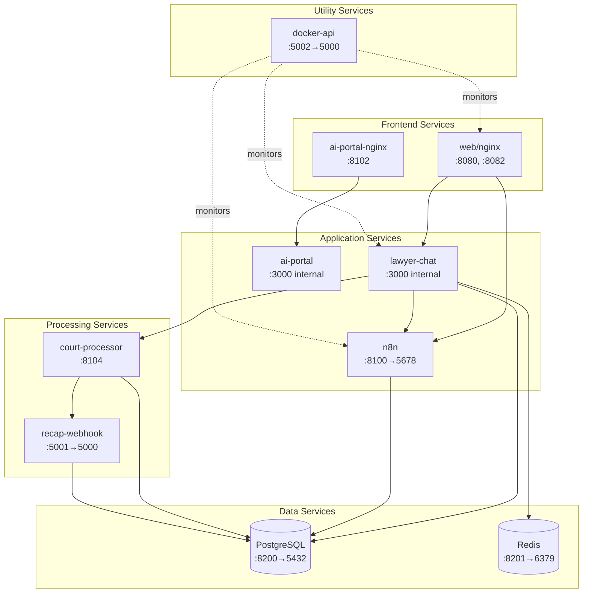

# Service Dependency Diagram

## Service Architecture Overview

## Service Dependency Matrix

| Service | Depends On | Exposed Ports | Internal Ports | Purpose |
|---------|-----------|---------------|----------------|---------|
| **web** (nginx) | n8n | 8080, 8082 | 80, 8082 | Main web server, reverse proxy |
| **db** (PostgreSQL) | - | 8200 | 5432 | Primary database |
| **redis** | - | 8201 | 6379 | Cache & session storage |
| **n8n** | db | 8100 | 5678 | Workflow automation |
| **lawyer-chat** | db, n8n, redis | - | 3000 | Legal chat application |
| **ai-portal** | - | - | 3000 | AI services portal |
| **ai-portal-nginx** | ai-portal | 8102 | 80 | AI portal proxy |
| **court-processor** | db, recap-webhook | 8104 | 8104 | Court document processor |
| **recap-webhook** | db | 5001 | 5000 | RECAP document handler |
| **docker-api** | Docker socket | 5002 | 5000 | Docker control API |

## Network Architecture

### Frontend Network
- web (nginx)
- n8n
- lawyer-chat
- ai-portal
- ai-portal-nginx
- docker-api

### Backend Network
- web (nginx)
- db (PostgreSQL)
- n8n
- lawyer-chat
- court-processor
- recap-webhook
- redis

## Service Start Order

1. **Tier 1** (No dependencies)
   - db (PostgreSQL)
   - redis

2. **Tier 2** (Database dependent)
   - n8n (depends on db)
   - recap-webhook (depends on db)

3. **Tier 3** (Multi-service dependent)
   - court-processor (depends on db, recap-webhook)
   - web (depends on n8n)

4. **Tier 4** (Application layer)
   - lawyer-chat (depends on db, n8n, redis)
   - ai-portal (standalone)

5. **Tier 5** (Proxy layer)
   - ai-portal-nginx (depends on ai-portal)

6. **Tier 6** (Monitoring)
   - docker-api (optional, monitors other services)

## Key Observations

### Critical Path Services
1. **PostgreSQL** - Required by 5 services
2. **n8n** - Required by web and lawyer-chat
3. **Redis** - Required by lawyer-chat for sessions

### Service Clusters
1. **Court Processing Cluster**: court-processor + recap-webhook
2. **AI Portal Cluster**: ai-portal + ai-portal-nginx
3. **Main App Cluster**: web + n8n + lawyer-chat

### Port Mapping Strategy
- **8000 range**: External access ports
- **5000 range**: Internal service ports
- **3000**: Next.js applications (internal only)

## Optional Services (Not in main docker-compose.yml)

### From docker-compose.haystack.yml
- elasticsearch (:9200)
- haystack-service (:8000)

### From docker-compose.doctor.yml
- doctor (:8083)

### From docker-compose.bitnet.yml
- bitnet (:1234)

## Health Check Dependencies

Services monitor their dependencies via health checks:
- lawyer-chat → checks `/chat/api/csrf`
- n8n → checks `/healthz`
- court-processor → checks `http://localhost:8104/health`
- PostgreSQL → uses `pg_isready`
- Redis → uses `redis-cli ping`