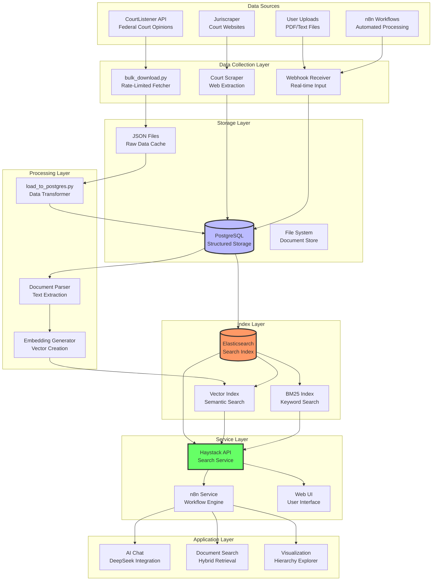
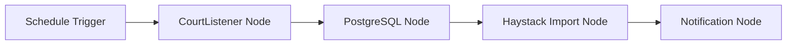

# Data Pipeline Overview

## Architecture Overview

The Aletheia v0.1 platform implements a sophisticated multi-stage data pipeline that processes legal documents from various sources through enrichment, storage, and indexing layers to enable advanced RAG (Retrieval-Augmented Generation) capabilities.



## Data Flow Stages

### Stage 1: Data Collection

#### CourtListener Integration
```
API Token → Rate Limiter → Bulk Download → JSON Cache
```
- **Rate Limit**: 4,500 requests/hour
- **Batch Size**: 100 items per request
- **Data Types**: Dockets, Opinions, Clusters

#### Juriscraper Integration
```
Court Website → Scraper → Parser → PostgreSQL
```
- **Courts**: Federal and state courts
- **Frequency**: Daily updates
- **Format**: HTML to structured data

### Stage 2: Data Storage

#### PostgreSQL Schema

```mermaid
erDiagram
    court_data_schema {
        cl_dockets "CourtListener cases"
        cl_opinions "Opinion documents"
        cl_clusters "Opinion groups"
        cl_docket_entries "Docket entries"
        court_documents "Juriscraper docs"
        unified_court_data "Combined view"
    }
    
    cl_dockets ||--o{ cl_opinions : contains
    cl_clusters ||--o{ cl_opinions : groups
    cl_dockets ||--o{ cl_docket_entries : has
```

#### Key Tables
- **cl_dockets**: Case metadata, judges, parties
- **cl_opinions**: Full text opinions, authors
- **court_documents**: Juriscraper extractions
- **unified_court_data**: Materialized view combining all sources

### Stage 3: Processing & Enrichment

#### Text Processing Pipeline
```python
Raw Document → Text Extraction → Cleaning → Chunking → Embedding
```

1. **Text Extraction**
   - PDF parsing with OCR fallback
   - HTML cleaning and normalization
   - Metadata preservation

2. **Embedding Generation**
   - Model: BAAI/bge-small-en-v1.5
   - Dimensions: 384
   - Batch processing for efficiency

### Stage 4: Indexing

#### Elasticsearch Configuration

```json
{
  "mappings": {
    "properties": {
      "content": {
        "type": "text",
        "analyzer": "legal_analyzer"
      },
      "vector": {
        "type": "dense_vector",
        "dims": 384,
        "index": true,
        "similarity": "cosine"
      },
      "metadata": {
        "type": "object",
        "properties": {
          "court": {"type": "keyword"},
          "judge": {"type": "keyword"},
          "date_filed": {"type": "date"},
          "is_patent_case": {"type": "boolean"}
        }
      }
    }
  }
}
```

### Stage 5: Search & Retrieval

#### Search Modes

1. **BM25 Search**
   - Traditional keyword matching
   - Legal term boosting
   - Phrase proximity scoring

2. **Vector Search**
   - Semantic similarity
   - Context-aware retrieval
   - Cross-lingual capabilities

3. **Hybrid Search**
   - Combines BM25 + Vector scores
   - Configurable weight balancing
   - Best overall performance

## Current Implementation Status

### ✅ Fully Implemented
- CourtListener API integration
- PostgreSQL storage schema
- Basic Haystack ingestion
- BM25 and vector search
- n8n custom node (7/8 operations)

### 🚧 Partially Implemented
- Scheduled updates (manual only)
- PDF text extraction (limited)
- Citation parsing
- Judge analytics

### ❌ Not Implemented
- Real-time webhooks
- Batch hierarchy endpoint
- Advanced NLP pipelines
- Multi-language support

## Performance Metrics

### Data Volume
- **CourtListener**: ~3,400 opinions/month per court
- **PostgreSQL**: ~10GB indexed data
- **Elasticsearch**: ~15GB with vectors

### Processing Speed
- **Ingestion**: 50 documents/second
- **Embedding**: 100 documents/minute
- **Search**: <100ms average latency

### Resource Usage
- **PostgreSQL**: 2GB RAM
- **Elasticsearch**: 4GB RAM
- **Haystack Service**: 1GB RAM

## Usage Examples

### 1. Manual Data Import
```bash
# Download from CourtListener
python court-processor/courtlistener_integration/bulk_download.py \
  --court txed --days 30

# Load to PostgreSQL
python court-processor/courtlistener_integration/load_to_postgres.py \
  --input-dir /data/courtlistener/txed

# Ingest to Haystack
python court-processor/courtlistener_integration/ingest_to_haystack.py \
  --limit 1000
```

### 2. n8n Workflow Automation


### 3. Search Integration
```python
# Via Haystack API
response = requests.post("http://localhost:8000/search", json={
    "query": "patent invalidity Delaware",
    "filters": {"metadata.court": "ded"},
    "use_hybrid": True
})

# Via n8n workflow
# Configure Haystack Search node with same parameters
```

## Best Practices

### Data Quality
1. **Validation**: Check for complete text before indexing
2. **Deduplication**: Use document hashes to prevent duplicates
3. **Metadata Standards**: Consistent field naming and formats

### Performance Optimization
1. **Batch Processing**: Process 50-100 documents at once
2. **Async Operations**: Use connection pooling
3. **Index Optimization**: Regular index maintenance

### Monitoring
1. **Health Checks**: All services expose /health endpoints
2. **Metrics**: Track ingestion rates and search performance
3. **Logging**: Centralized logging for debugging

## Future Enhancements

### Short Term (1-2 weeks)
- [ ] Implement scheduled n8n workflows
- [ ] Add batch_hierarchy endpoint
- [ ] Improve error recovery

### Medium Term (1-2 months)  
- [ ] CourtListener webhooks
- [ ] Advanced citation parsing
- [ ] Judge-based analytics dashboard

### Long Term (3-6 months)
- [ ] Multi-jurisdiction support
- [ ] Graph database for citations
- [ ] ML-based case prediction

## Troubleshooting Guide

### Common Issues

**PostgreSQL Connection Failed**
```bash
# Check connection string
echo $DATABASE_URL

# Test connection
psql $DATABASE_URL -c "SELECT 1"
```

**Elasticsearch Out of Memory**
```yaml
# Increase heap in docker-compose
environment:
  - "ES_JAVA_OPTS=-Xms4g -Xmx4g"
```

**Slow Search Performance**
```python
# Enable query caching
search_params["cache"] = True

# Reduce result size
search_params["top_k"] = 10
```

## Related Documentation

- [CourtListener Integration](../court-processor/courtlistener_integration/README.md)
- [Haystack Service](../n8n/haystack-service/README.md)
- [n8n Custom Nodes](../n8n/CLAUDE.md)
- [Main Project README](../README.md)